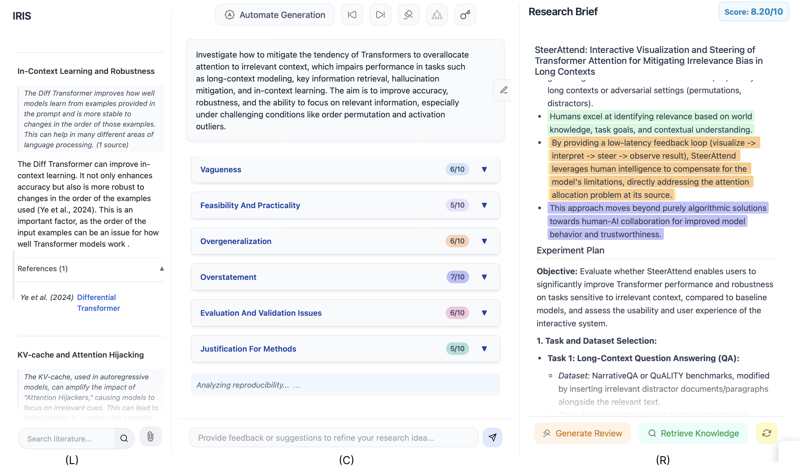

# 🌟 Interactive Research Ideation System

🎉 **Accepted to ACL 2025 System Demonstration Track!**

Official repository for the paper <a href="https://arxiv.org/abs/2504.16728" target="_blank">IRIS: Interactive Research Ideation System</a>


## 🔗 Setup

This project uses ```uv``` for package management, but you can use any virtual environment.

1.  **Clone the repository:**
    ```bash
    git clone https://github.com/Anikethh/IRIS-Interactive-Research-Ideation-System.git
    cd IRIS-Interactive-Research-Ideation-System
    ```

2.  **Activate virtual environment:**
    ```bash
    uv sync
    source .venv/bin/activate 
    ```

3.  **Set Environment Variables:**
    Setup your API keys:
    ```bash
    export SEMANTIC_SCHOLAR_API_KEY="your_semantic_scholar_api_key" 
    export GEMINI_API_KEY="your_google_gemini_api_key" 
    ```

## 🖥️ Running the Application

Ensure your virtual environment is activated, then run:

```bash
python app.py
```



## 📋 Requirements

- Semantic Scholar API Key
-  LLM API Key for any provider supported by LiteLLM

## 📧 Cite
```
@inproceedings{garikaparthi-etal-2025-iris,
    title = "{IRIS}: Interactive Research Ideation System for Accelerating Scientific Discovery",
    author = "Garikaparthi, Aniketh  and
      Patwardhan, Manasi  and
      Vig, Lovekesh  and
      Cohan, Arman",
    editor = "Mishra, Pushkar  and
      Muresan, Smaranda  and
      Yu, Tao",
    booktitle = "Proceedings of the 63rd Annual Meeting of the Association for Computational Linguistics (Volume 3: System Demonstrations)",
    month = jul,
    year = "2025",
    address = "Vienna, Austria",
    publisher = "Association for Computational Linguistics",
    url = "https://aclanthology.org/2025.acl-demo.57/",
    doi = "10.18653/v1/2025.acl-demo.57",
    pages = "592--603",
    ISBN = "979-8-89176-253-4",
    abstract = "The rapid advancement in capabilities of large language models (LLMs) raises a pivotal question: How can LLMs accelerate scientific discovery? This work tackles the crucial first stage of research, generating novel hypotheses. While recent work on automated hypothesis generation focuses on multi-agent frameworks and extending test-time compute, none of the approaches effectively incorporate transparency and steerability through a synergistic Human-in-the-loop (HITL) approach. To address this gap, we introduce IRIS for interactive hypothesis generation, an open-source platform designed for researchers to leverage LLM-assisted scientific ideation. IRIS incorporates innovative features to enhance ideation, including adaptive test-time compute expansion via Monte Carlo Tree Search (MCTS), fine-grained feedback mechanism, and query-based literature synthesis. Designed to empower researchers with greater control and insight throughout the ideation process. We additionally conduct a user study with researchers across diverse disciplines, validating the effectiveness of our system in enhancing ideation. We open-source our code at https://github.com/Anikethh/IRIS-Interactive-Research-Ideation-System."
}
```

## 📬 Contact

For any questions or further information, please get in touch with aniketh.g@tcs.com
